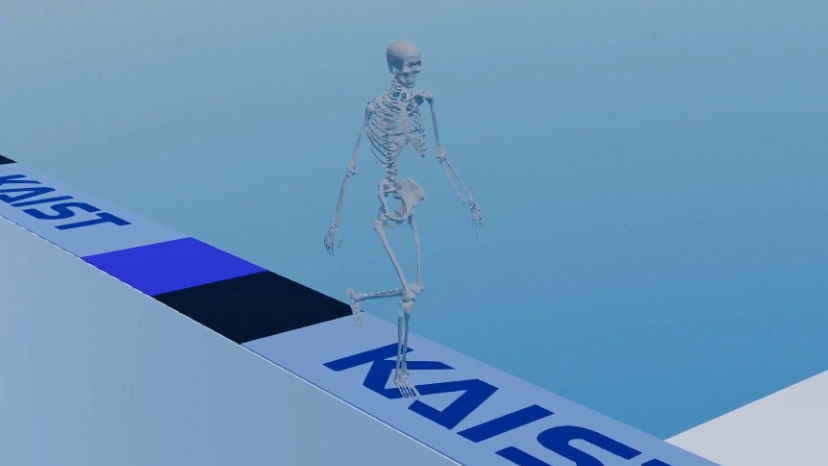
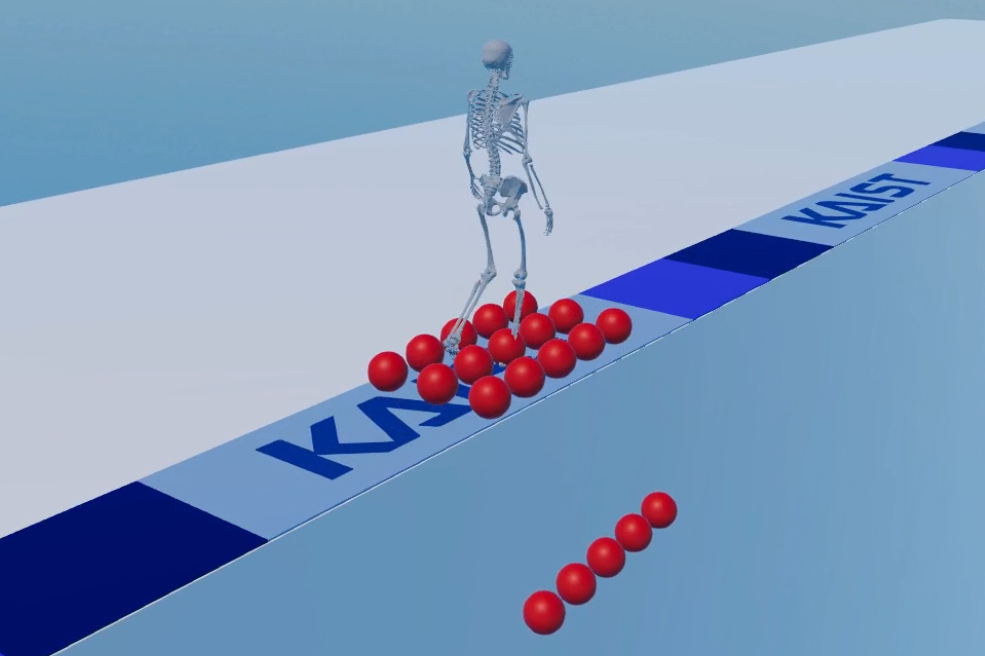
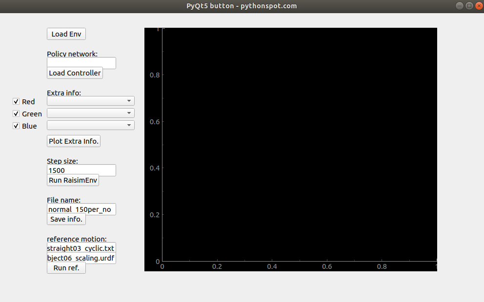

## RaisimGymMeta

RaisimGymMeta: Meta reinforcement learning to make subject-specific gait controllers

<p align="center">


</p>

## How to use

``` python3 ./setup.py develop --user --prefix= --CMAKE_PREFIX_PATH "../../raisim_build" ```

python 파일을 제외한 environmet.hpp, vectorizedEnvionment.hpp 등의 파일을 수정하였다면 build를 다시 해야한다.  

``` python ./raisimGymTorch/env/envs/rsg_gaitmsk_MAML/runnerMod_train.py ```

학습 실행하는 코드는 위와 같다.  

``` python ./raisimGymTorch/env/envs/rsg_gaitmsk_MAML/runnerMod_train.py --mode "retrain" --ppo_weight "policy_path"```

re-training을 하려면 위의 코드를 실행하면 된다. ppo_weight는 학습된 policy 파일을 의미한다.  
ex) /home/opensim2020/Desktop/pytorch_result_new/20211031/2021-10-27-18-16-49/full_21900.pt  

학습된 policy는 data 폴더 안에 저장된다.  

초기 자세를 위한 reference data의 dimension은 다음과 같다.  

```
[
	duration of frame in seconds (1D),
	root position (3D),
	root rotation (4D),
	lumbar rotation (4D),
	right hip rotation (4D),
	right knee rotation (1D),
	right ankle rotation (3D),
	right shoulder rotation (4D),
	right elbow rotation (1D),
	left hip rotation (4D),
	left knee rotation (1D),
	left ankle rotation (3D),
	left shoulder rotation (4D),
	left elbow rotation (1D)
]
```


## raisimGymTorchBio, treadmill
## Modified the raisimGymTorch in raisimlib 1.0

### put it in parallel with the raisimGymTorch as below
raisimlib/raisimGymTorch  
raisimlib/raisimGymTorchBio

### Run

1. Compile raisimgym in raisimlib/raisimGymTorchBio: 
```python ./setup.py develop --user --prefix= --CMAKE_PREFIX_PATH "../../raisim_build"```

2. run runnerMod.py of the task for training (for humanoid2d example): 
```python ./raisimGymTorch/env/envs/rsg_humanoid2d/runnerMod.py --mode "train"```

3. run runnerMod.py of the task for testing (for humanoid2d example): 
```python ./raisimGymTorch/env/envs/rsg_humanoid2d/runnerMod.py --mode "test" --test_modelfile_name "FULL_PATH_NAME_YOUR_PPO_MODEL.pt" --test_envscaledir_name "FULL_PATH_YOUR_MEAN_AND_VAR_LOG_DIR" --test_envscale_niter "CHOOSE_ITERATION_ID" --total_timesteps 4000```

### Debugging
1. Compile raisimgym with debug symbols: ```python setup develop --Debug```. This compiles <YOUR_APP_NAME>_debug_app
2. Run it with Valgrind. I strongly recommend using Clion for 

### Todo
1. Saving and loading the torch model for retraining and testing  


## Pyqt_runner

pyqt_runner: GUI for analysis including motion play of reference data

<p align="center">

</p>

## How to use

``` python ./main.py ```

'Load Env' button: Load the environment to test the trained policy  
- build를 완료한 상태의 environment가 불러와진다.  

'Load Controller button: Load the trained polocy  
- policy network의 path를 써주면 된다. ex) /home1/home2/home3/full_9500,pt  
 
'Plot Extra info' button: Plot the selected data for analysis  
- extra info를 box에서 선택해준뒤 plot 하면 된다. 주의할 점은 Environment.hpp 파일의 extra info 함수 안에 포함되어 있는 정보만 선택할 수 있다.  

'Run RaisimEnv' button: Run the trained policy in the loaded environment  
- 학습된 policy를 test하는 버튼이다. step size 만큼의 simulation time을 test한다.  

'Save info' button: Save as the json files  
- json file 형식으로 모든 extra info가 저장된다.  

'Run ref' button: Show the reference motion with the urdf model  
- urdf model과 reference motion을 선택하고 버튼을 누르면 reference motion이 raisimUnity에서 보여진다.  

If you want to see the visual objects in the environment, use the raisimUnity 

