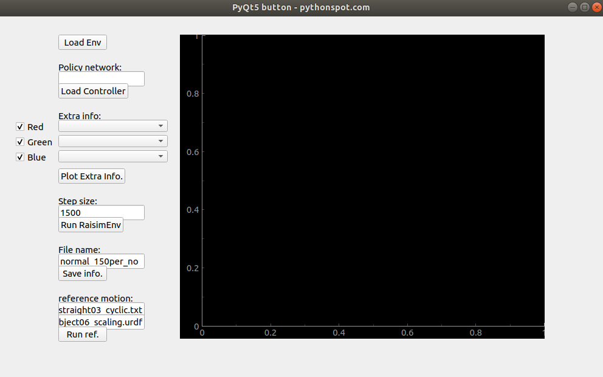

## Pyqt_runner

pyqt_runner: GUI for analysis including motion play of reference data

<p align="center">

</p>

## How to use

``` python ./main.py ```

'Load Env' button: Load the environment to test the trained policy  
- build를 완료한 상태의 environment가 불러와진다.  

'Load Controller button: Load the trained polocy  
- policy network의 path를 써주면 된다. ex) /home1/home2/home3/full_9500,pt  
 
'Plot Extra info' button: Plot the selected data for analysis  
- extra info를 box에서 선택해준뒤 plot 하면 된다. 주의할 점은 Environment.hpp 파일의 extra info 함수 안에 포함되어 있는 정보만 선택할 수 있다.  

'Run RaisimEnv' button: Run the trained policy in the loaded environment  
- 학습된 policy를 test하는 버튼이다. step size 만큼의 simulation time을 test한다.  

'Save info' button: Save as the json files  
- json file 형식으로 모든 extra info가 저장된다.  

'Run ref' button: Show the reference motion with the urdf model  
- urdf model과 reference motion을 선택하고 버튼을 누르면 reference motion이 raisimUnity에서 보여진다.  

If you want to see the visual objects in the environment, use the raisimUnity 


