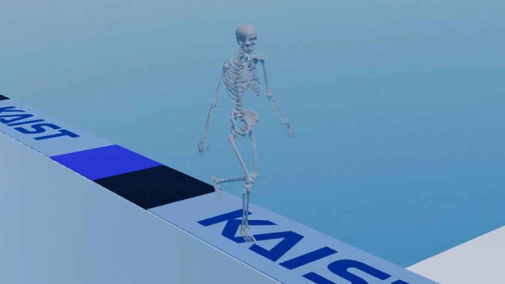
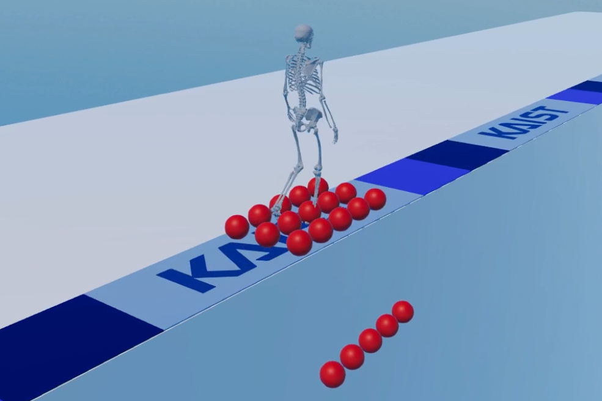

## RaisimGymMeta

RaisimGymMeta: Meta reinforcement learning to make subject-specific gait controllers

<p align="center">


</p>

## How to use

``` python3 ./setup.py develop --user --prefix= --CMAKE_PREFIX_PATH "../../raisim_build" ```

python 파일을 제외한 environmet.hpp, vectorizedEnvionment.hpp 등의 파일을 수정하였다면 build를 다시 해야한다.  

``` python ./raisimGymTorch/env/envs/rsg_gaitmsk_MAML/runnerMod_train.py ```

학습 실행하는 코드는 위와 같다.  

``` python ./raisimGymTorch/env/envs/rsg_gaitmsk_MAML/runnerMod_train.py --mode "retrain" --ppo_weight "policy_path"```

re-training을 하려면 위의 코드를 실행하면 된다. ppo_weight는 학습된 policy 파일을 의미한다.  
ex) /home/opensim2020/Desktop/pytorch_result_new/20211031/2021-10-27-18-16-49/full_21900.pt  

학습된 policy는 data 폴더 안에 저장된다.  

초기 자세를 위한 reference data의 dimension은 다음과 같다.  

```
[
	duration of frame in seconds (1D),
	root position (3D),
	root rotation (4D),
	lumbar rotation (4D),
	right hip rotation (4D),
	right knee rotation (1D),
	right ankle rotation (3D),
	right shoulder rotation (4D),
	right elbow rotation (1D),
	left hip rotation (4D),
	left knee rotation (1D),
	left ankle rotation (3D),
	left shoulder rotation (4D),
	left elbow rotation (1D)
]
```

